# QA E-Shop Test Execution Report

## 1. Test Strategy Summary
The testing strategy for the QA E-Shop followed a **Risk-Based, Automation-First approach** utilizing the **Page Object Model (POM)** pattern. 

* **Framework**: Playwright with Cucumber (Behavior Driven Development) for clear alignment between business requirements and technical execution.
* **Methodology**: 
    * **End-to-End (E2E)**: Focused on critical user journeys (CUJs) such as the "Golden Path" from login to order placement.
    * **Regression Testing**: Automated core functionalities (Search, Cart, Authentication) to ensure stability across deployments.
    * **Negative Testing**: Validated system resilience against invalid credentials, out-of-stock purchases, and form validation errors.
* **Tooling**: Used `testData.ts` for centralized data management and `hooks.ts` for automated browser lifecycle handling.

# Bug Report Summary

## Bug Index

| Bug ID  | Title                                      | Severity | Priority |
|---------|--------------------------------------------|----------|----------|
| BUG-01  | Admin Navigation Link Visible              | Medium   | High     |
| BUG-02  | Admin Dashboard Accessible Without Auth    | Critical | High     |
| BUG-03  | No Visible Authentication State After Login| High     | Medium   |
| BUG-04  | Floating Point Precision in Price Display  | Medium   | Medium   |
| BUG-05  | Debug Info Exposed in Product Detail Page  | Medium   | Medium   |
| BUG-06  | Out-of-Stock Product Can Be Added to Cart  | High     | High     |
| BUG-07  | Cart Allows Quantity Exceeding Stock       | Critical | High     |
| BUG-08  | Cart Empties on Page Refresh               | High     | Medium   |
| BUG-09  | Product Image Loads Slowly (Layout Shift)  | Medium   | Medium   |
| BUG-10  | Search Results Not Populating for Specific Product Query  | High   | High   |
| BUG-11  | Very Long Product Name Breaks UI Layout    | Medium   | Medium   |

---

### Severity Distribution

- Critical: 2
- High: 4
- Medium: 5

Total Defects Identified: 11

## BUG-01: Admin Navigation Link Visible to Anonymous Users

**Category:** UI Authorization / Information Disclosure  
**Severity:** Medium  
**Priority:** High  

### Description
The Admin navigation link is visible in the header for users who are not authenticated. The navigation component does not conditionally render based on authentication state or user role.

### Steps to Reproduce
1. Open browser.  
2. Navigate to `http://localhost:3000/`  
3. Do not log in.  
4. Observe the header navigation bar.  

### Expected Result
The Admin navigation link should only be visible to authenticated users with the `admin` role.

### Actual Result
The Admin link is visible to anonymous (unauthenticated) users.

### Screenshot
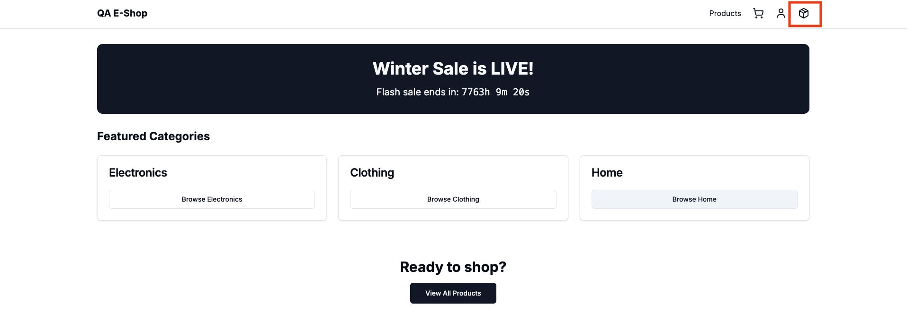

### Impact
Exposes internal system structure and administrative functionality to unauthenticated users, potentially aiding targeted attacks.

### Possible Root Cause
Navigation component does not validate authentication state or user role before rendering the Admin link.

### Recommended Fix
Add conditional rendering logic based on authentication state and role.

---

## BUG-02: Admin Dashboard Accessible Without Authentication

**Category:** Authorization / Security  
**Severity:** Critical  
**Priority:** High  

### Description
The Admin Dashboard is accessible without authentication. Clicking the Admin link or navigating directly to `/admin` loads administrative data without requiring login.

### Steps to Reproduce
- **Method 1 – UI Navigation**  
  1. Navigate to homepage without logging in.  
  2. Click Admin link.  
  3. Dashboard loads.  

- **Method 2 – Direct URL Access**  
  1. Open incognito window.  
  2. Navigate to `http://localhost:3000/admin`.  
  3. Dashboard loads.  

### Expected Result
User should be redirected to login or receive `403 Forbidden`.

### Actual Result
Admin dashboard loads with sensitive data.

### Screenshot
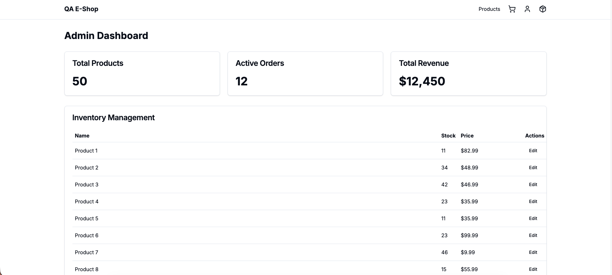

### Impact
Critical exposure of sensitive administrative data.

### Possible Root Cause
Admin route not protected by authentication middleware; role validation missing.

### Recommended Fix
Implement server-side authentication and RBAC middleware for all admin routes.

---

## BUG-03: No Visible Authentication State After Login

**Category:** Authentication / UX  
**Severity:** High  
**Priority:** Medium  

### Description
After login, the application does not display any visible indication of authenticated state (no profile info, role, or logout option).

### Steps to Reproduce
1. Login as admin or customer.  
2. Observe header/navigation area.  

### Expected Result
UI should display user info, role, or logout option.

### Actual Result
Login button disappears, but no indication of logged-in state.

### Screenshot
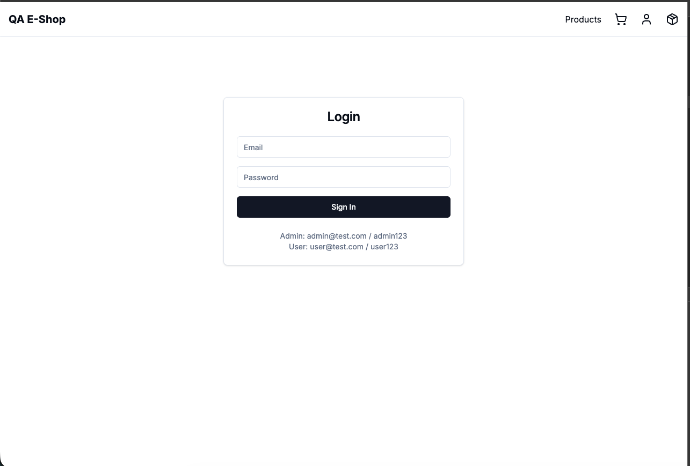

### Impact
Poor UX and confusion about session state.

### Possible Root Cause
Missing UI binding to authentication state; role not stored in global state/context.

### Recommended Fix
Bind authentication state to header component and display user info + logout option.

---

## BUG-04: Floating Point Precision Error in Product Price Display

**Category:** Business Logic / UI Formatting  
**Severity:** Medium  
**Priority:** Medium  

### Description
Product prices are displayed with excessive floating-point precision.

### Steps to Reproduce
1. Navigate to Electronics page.  
2. Observe product price displayed as `$25.9900000000000002`.  

### Expected Result
Price should be formatted to two decimal places (`$25.99`).

### Actual Result
Floating-point precision error visible.

### Screenshot
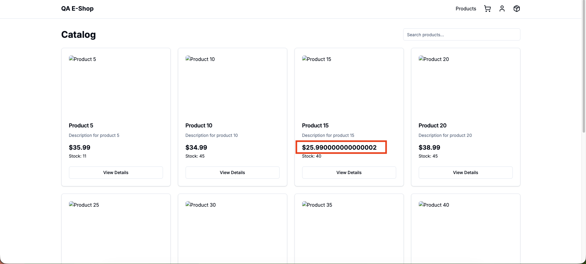

### Impact
Reduces user trust and appears unprofessional.

### Possible Root Cause
Price values not formatted using proper rounding method.

### Recommended Fix
Use `.toFixed(2)` or Intl.NumberFormat for currency formatting.

---

## BUG-05: Debug Information Exposed in Product Detail Page

**Category:** Security / UX  
**Severity:** Medium  
**Priority:** Medium  

### Description
Debug information is visible to end users on product detail page.

### Steps to Reproduce
1. Open product detail page.  
2. Scroll to product info section.  
3. Observe debug text `"Debug info: Screen Width 1280px"`.  

### Expected Result
Debug info should not be visible in production.

### Actual Result
Debug info displayed to users.

### Screenshot
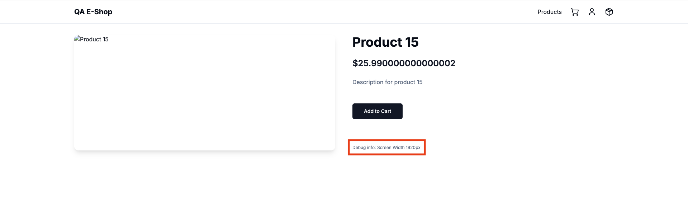

### Impact
Reveals internal implementation details.

### Possible Root Cause
Debug flag not disabled for production build.

### Recommended Fix
Remove debug logs and disable debug flags in production.

---

## BUG-06: Out-of-Stock Product Can Be Added to Cart

**Category:** Functionality / Business Logic  
**Severity:** High  
**Priority:** High  

### Description
Out-of-stock products can still be added to cart.

### Steps to Reproduce
1. Navigate to product listing.  
2. Select product with stock = 0.  
3. Click Add to Cart.  

### Expected Result
Product should not be added.

### Actual Result
Product added successfully.

### Screenshot
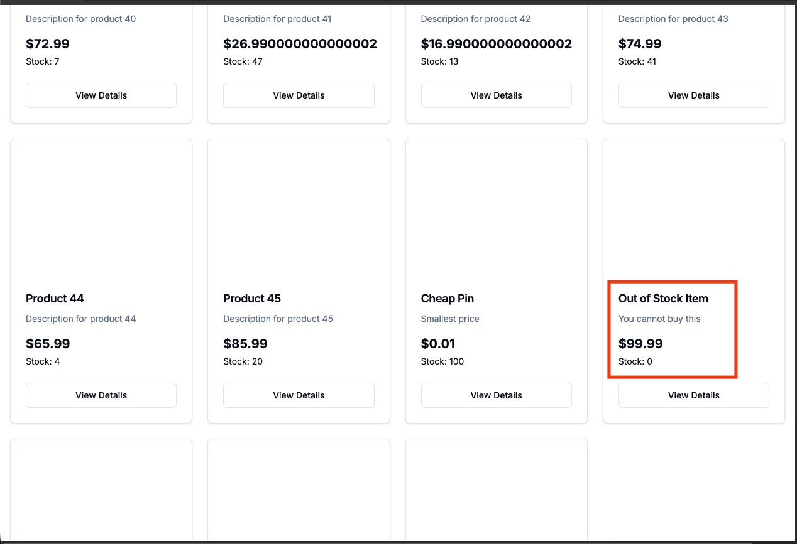

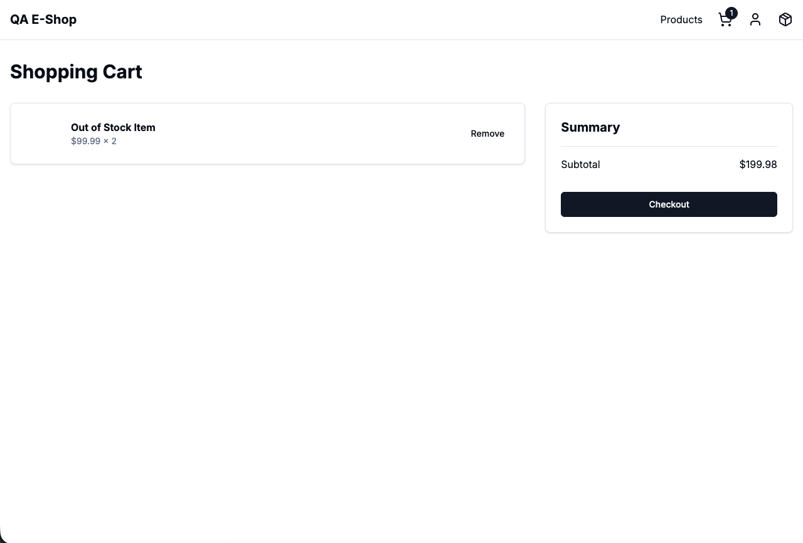

### Impact
Inventory validation failure; risk of overselling.

### Possible Root Cause
Missing stock validation in frontend/backend.

### Recommended Fix
Disable Add to Cart button for stock=0 and enforce backend validation.

---

## BUG-07: Cart Allows Quantity Exceeding Available Stock

**Category:** Business Logic / Inventory Validation  
**Severity:** Critical  
**Priority:** High  

### Description
Users can add more items than available stock.

### Steps to Reproduce
1. Open product with stock 6.  
2. Add more than 6 items.  
3. Observe cart.  

### Expected Result
Quantity restricted to available stock.

### Actual Result
Cart exceeds inventory.

### Screenshot
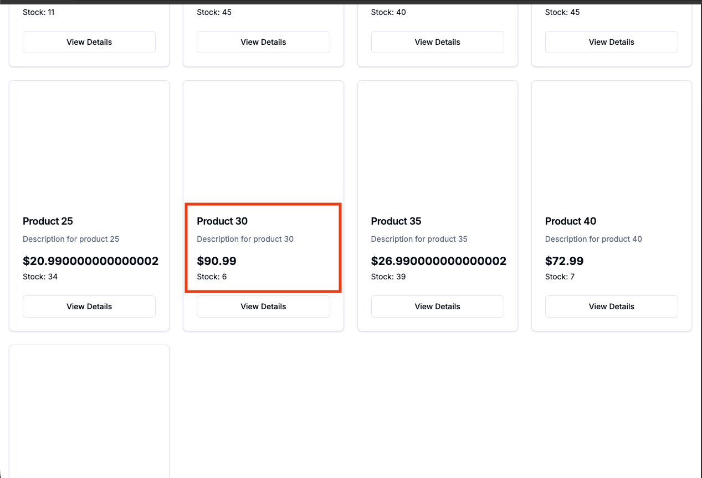
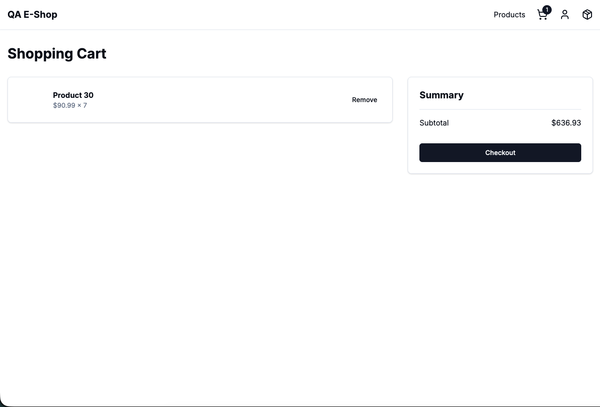

### Impact
Inventory inconsistency; financial risk.

### Possible Root Cause
Backend does not enforce stock limits.

### Recommended Fix
Add backend validation to restrict cart quantity to stock.

---

## BUG-08: Cart Empties on Page Refresh

**Category:** Functionality / State Management  
**Severity:** High  
**Priority:** Medium  

### Description
Cart items are removed on page refresh.

### Steps to Reproduce
1. Add products to cart.  
2. Refresh page.  

### Expected Result
Cart items should persist.

### Actual Result
Cart becomes empty.

### Screenshot
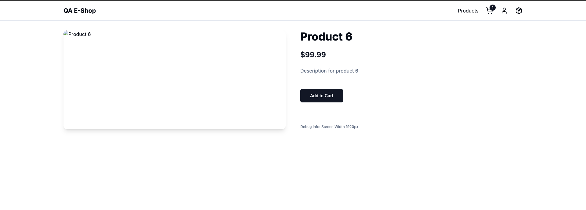
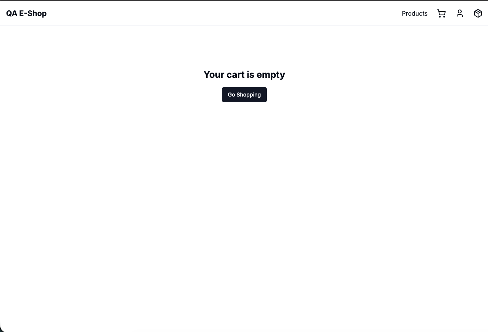

### Impact
Poor UX; loss of user state.

### Possible Root Cause
Cart state stored only in memory.

### Recommended Fix
Persist cart state in localStorage or backend session.

---

## BUG-09: Product Image Loads Slowly and Causes Layout Shift

**Category:** UX / Performance  
**Severity:** Medium  
**Priority:** Medium  

### Description
Product image loads slowly and causes layout shift.

### Steps to Reproduce
1. Open product detail page.  
2. Observe image loading behavior.  

### Expected Result
Image container space reserved; no layout shift.

### Actual Result
Blank area initially; layout shifts when image loads.

### Screenshot
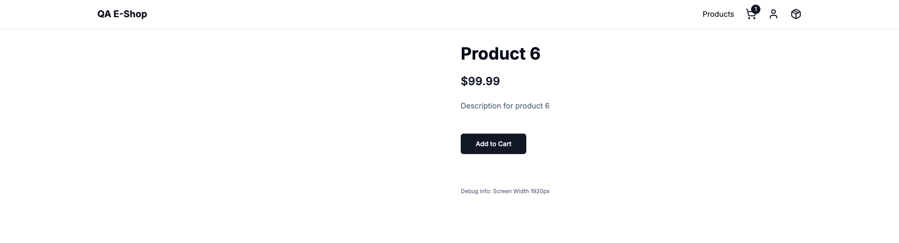
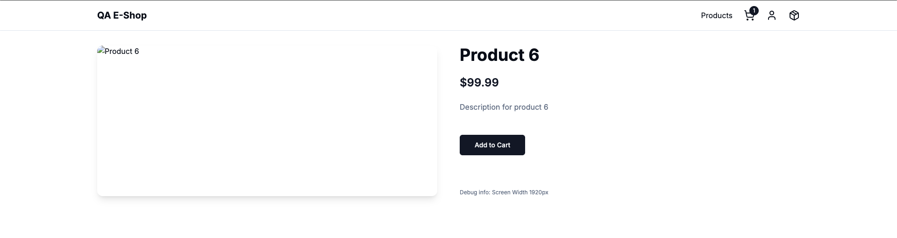

### Impact
Poor UX; layout instability (CLS issue).

### Possible Root Cause
Image loading not optimized; placeholder missing.

### Recommended Fix
Use Next.js `<Image>` component with `placeholder="blur"` or reserve container space.

---

## BUG-10: Search Results Not Populating for Specific Product Query

**Category:** Functionality / API Integration  
**Severity:** High  
**Priority:** High  

### Description

When searching for a specific product (e.g., "Product 19"), the backend API returns the correct product data; however, the UI does not update to display the expected filtered result.

Although the network response contains the correct product object, the product grid continues to display unrelated products (e.g., Product 1, Product 2, Product 3, Product 4).

This indicates a disconnect between the API response and frontend rendering logic.

### Steps to Reproduce

1. Navigate to `http://localhost:3000/products`
2. Enter a valid product name in the search field (e.g., `Product 19`)
3. Observe the Network tab in DevTools:
   - Confirm that the API request `/products?search=Product 19` returns correct product data
4. Observe the product grid displayed on the UI

### Expected Result

- Only the matching product (e.g., Product 19) should be displayed.
- All unrelated products should be removed from the grid.
- UI should reflect the API response accurately.

### Actual Result

- API returns correct product data.
- UI continues to display default catalog products.
- Search results are not reflected in the product listing.

### Screenshot

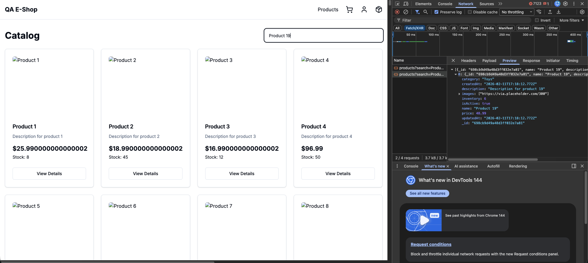

### Impact

- Search functionality is effectively broken.
- Users cannot reliably find specific products.
- Creates inconsistency between backend and frontend.
- Reduces trust in system behavior.
- Affects core user journey (product discovery).

### Possible Root Cause

- Search response not bound to state properly.
- React state not updated after API response.
- Incorrect dependency handling in useEffect.
- Search input not triggering re-render.
- Cached catalog state overriding search results.

---

## BUG-11: Very Long Product Name Breaks UI Layout

**Category:** UI / Responsiveness / Layout  
**Severity:** Medium  
**Priority:** Medium  

### Description

Products with excessively long names are not properly handled in the catalog view.  
The product title overflows horizontally beyond the card boundary, breaking the layout structure and affecting overall UI consistency.

The text does not wrap, truncate, or apply ellipsis properly.

### Steps to Reproduce

1. Navigate to `http://localhost:3000/products`
2. Locate the product with a very long name (e.g., "Very Long Name Product AAAAAAAAAAAAA...")
3. Observe how the product title is rendered inside the product card.

### Expected Result

- Product name should:
  - Wrap to the next line, OR
  - Be truncated with ellipsis (`...`), OR
  - Be limited to a fixed number of lines using proper CSS handling.
- Layout should remain intact.
- No horizontal overflow should occur.

---

### Actual Result

- Product name overflows outside the card boundary.
- UI alignment is disrupted.
- Layout appears broken and inconsistent with other product cards.

### Screenshot

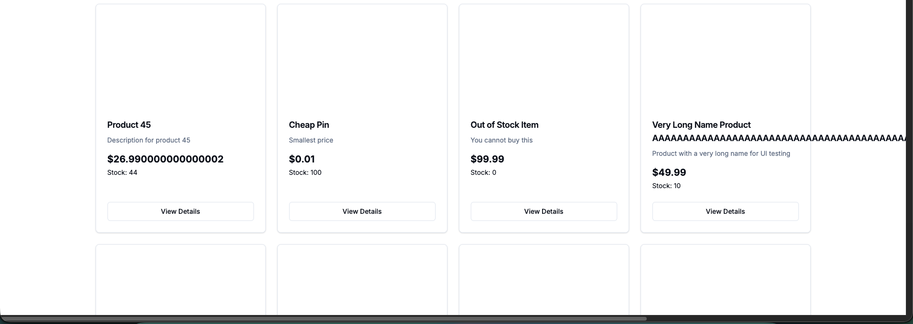

### Impact

- Poor visual presentation.
- Layout instability.
- Breaks responsive design principles.
- Reduces overall UI quality and professionalism.
- Can worsen on smaller screen sizes (mobile view).

### Possible Root Cause

- Missing `text-overflow: ellipsis`
- Missing `overflow: hidden`
- Missing `line-clamp` configuration
- No max-width or wrapping rule applied to product title container

## 3. Test Coverage Summary (40+ Scenarios)
The combined manual and automated test suite provides coverage across the following functional domains

| Module | Coverage Description |
| :--- | :--- |
| **Authentication** | Admin/User login, invalid credentials, and session management. |
| **Authorization** | Role-Based Access Control (RBAC) for Admin Dashboard access. |
| **Product Catalog** | Homepage loading, category navigation, and product details view. |
| **Search** | Query input and results display logic. |
| **Cart Management** | Adding/removing items, badge incrementing, and duplicate item logic. |
| **Checkout Flow** | Shipping details entry, payment validation, and order confirmation. |

## 4. Recommendations / Next Steps
* **Fix State Persistence**: Implement `localStorage` synchronization for the cart so users don't lose progress on page reloads.
* **Currency Utility**: Implement a formatting utility on the frontend to round prices to two decimal places.
* **API Validation**: Move stock validation from the frontend (browser alerts) to the backend API to prevent "race conditions" during checkout.
* **CI/CD Integration**: Integrate the Cucumber-Playwright suite into a Github Actions or GitLab CI pipeline to run automatically on every Pull Request.
* **Enhanced Reporting**: Implement `cucumber-html-reporter` for visual execution logs and screenshot capture on failure.

